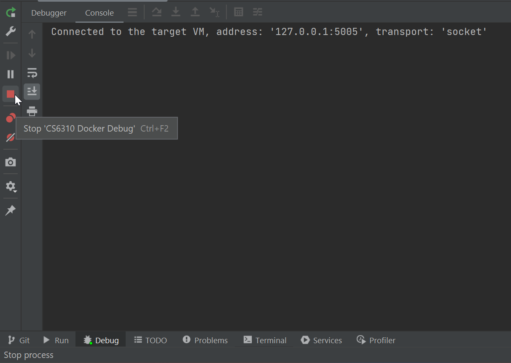
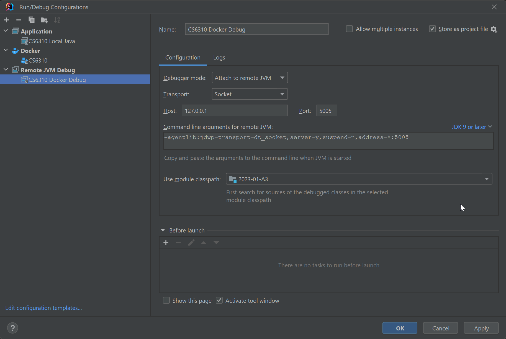

A3 Repo for CS6310
# To Install Docker go to:
```
https://docs.docker.com/get-docker/
```

# Note please run all scripts from the project root directory

### To build:

```
docker build -t gatech/dronedelivery -f Dockerfile ./
```

### To test a specific scenario against the initial jar
#### Mac / Linux
```
./scripts/test.sh <scenario>
```
#### Windows
```
.\scripts\test.sh <scenario>
```

### To batch run the test scenarios
#### Mac / Linux
```
./scripts/batch.sh
```
#### Windows
```
.\scripts\batch.sh
```

### To run in interactive mode
###### If you are not debugging use 1.a & 2.a
###### If you want to attach a debug session use 1.b and 2.b
#### Step 1.a from the host
```
docker run --rm -ti gatech/dronedelivery sh
```
#### Step 1.b from the host with debug
##### More details at the end
```
docker run --rm -p 5005:5005 -ti gatech/dronedelivery sh
```
#### Step 2.a from the container
```
java -jar drone_delivery.jar
```
#### Step 2.b from the container with debug
##### More details at the end
```
java -agentlib:jdwp=transport=dt_socket,server=y,suspend=n,address=*:5005 -jar drone_delivery.jar
```
#### Step 3 from the jar
* From there you can run any of the commands listed from the assignment:
```
make_store,<Store>,<InitialRevenue>
display_stores
sell_item,<Store>,<Item>,<Weight>
display_items,<Store>
make_pilot,<Account>,<FirstName>,<LastName>,<PhoneNumber>,<TaxId>,<LicenseId>,<ExperienceLevel>
display_pilots
make_drone,<Store>,<DroneId>,<WeightCapacity>,<NumberOfDeliveries>
display_drones,<Store>
fly_drone,<Store>,<DroneId>,<PilotAccount>
make_customer,<Account>,<FirstName>,<LastName>,<PhoneNumber>,<CustomerRating>,<Credits>
display_customers
start_order,<Store>,<OrderId>,<DroneId>,<CustomerAccount>
display_orders,<Store>
request_item,<Store>,<OrderId>,<Item>,<Quantity>,<UnitPrice>
purchase_order,<Store>,<OrderId>
cancel_order,<Store>,<OrderId>
transfer_order,<Store>,<OrderId>,<DroneId>
display_efficiency
stop
```

### To run & test in interactive mode

```
java -jar drone_delivery.jar < commands_00.txt > drone_delivery_00_results.txt
diff -s drone_delivery_00_results.txt drone_delivery_initial_00_results.txt > results_00.txt
cat results_00.txt
```

### To run a specific scenario with your jar and output to localhost
The "mkdir docker_results ; " would not be needed after the 1st run, but just in case you have not made the directory yet with another command.
```
mkdir docker_results ; docker run --rm gatech/dronedelivery sh -c 'java -jar drone_delivery.jar < commands_00.txt'  > docker_results/drone_delivery_00_results.txt
```

### If you get stuck in an infinite loop
Simply stop and remove the running container
```
docker ps
docker rm -f <container_id>
```

### To test with a clean image & container
After running the below command you will need to run the build command again
#### Windows
```
docker ps -aq | % { docker stop $_ } | % { docker rm -f $_ } | docker images -f "dangling=true" -aq | % { docker rmi -f $_ } | docker images gatech/* -aq | % { docker rmi -f $_ }
```
#### Mac
```
docker ps -aq | xargs docker stop | xargs docker rm -f && docker images -f "dangling=true" -aq | xargs docker rmi -f && docker images "gatech/*" -aq | xargs docker rmi -f
```

### Remote Docker Debug with IntelliJ
#### Using Run / Debug IntelliJ configurations
```
Start the Docker Container
```

```
Create a Terminal, 3 different examples
```


```
Run java application on port 5005
```

```
Start Debug
```

```
To Stop Debug & Docker
```



#### Using CMD / Powershell / Terminal to start & IntelliJ to Debug
##### For the Debug steps, see above
```
Start the Docker Container
```


### Example IntelliJ Configurations There should be no red or errors.
#### You may need to select the right docker service, ro java version that you have installed.





### To zip your code
You should validate your zip file has everything needed. Your src folder & everything under your src folder. Nothing else should be in your zip file. < filename > should be replaced with 2023-09-A3
#### Mac / Linux
```
./scripts/zip.sh <filename>
```
#### Windows
```
.\scripts\zip.ps1 <filename>
```

### Goals for completion
```
1) All your test files that exist should come back with they are identical when doing the diff
2) EX: 'Files drone_delivery_00_results.txt and drone_delivery_initial_00_results.txt are identical'
3) For the tests that exist you will also see a time estimate when running batch.sh under the identical or different output
4) EX: Elapsed time: 1 s
5) The files that are hidden and not proviced yet (The missing ones out of the 65 total) will come back like the below when running the batch script
6) EX: 'File commands_10.txt does not exist.'
7) You should not need to or change the diff commands or docker files or any file outside your src directory
8) Double check your line endings in your testing / result files if needed, everything should have just LF not CLRF 
```

### Assignment Q&A Post
Please post any questions about docker or otherwise to the post linked below:  
[Link To Ed Discussion](https://edstem.org/us/courses/43008/discussion/3495563)

###### Thanks to those who have helped further our capabilities with docker & intellij. 
